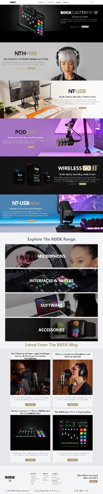

#  RØDE.headphones website  Clone Project-3-Tailwind CSS 

### Mostly I used Tailwind CSS for this project.

### My Website is Fully Responsive , you can view in mobile , tab or desktop.

[Live Link](https://rode-headphones-home-page-clone.netlify.app/)

### For making my web page responsive mostly I used flext box and grid.

### I also used a little bit of media queries of making responsive navigation bar.

### It took approx 10 hours to completed.
